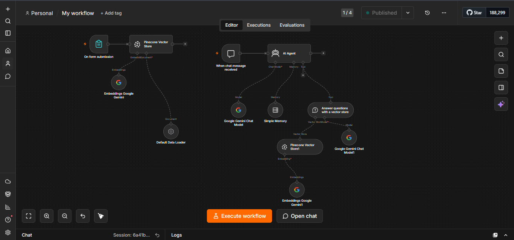
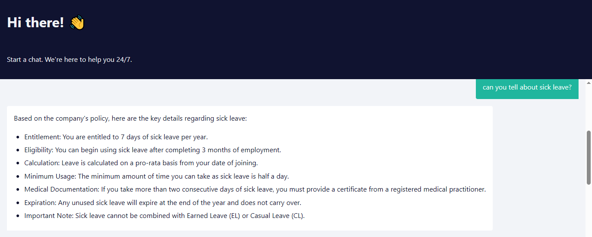

# RAG-based HR Policy Chatbot using n8n, Gemini & Pinecone


An AI-powered HR policy chatbot built using **n8n**, **Google Gemini**, and **Pinecone Vector Database** with Retrieval-Augmented Generation (RAG) architecture.

The chatbot answers employee HR-related questions such as leave policies, eligibility, and company rules using semantic document retrieval.

---

# Features

- HR policy question answering chatbot
- Retrieval-Augmented Generation (RAG)
- Semantic search using vector embeddings
- Conversational memory support
- Automated AI workflow using n8n
- Google Gemini integration
- Pinecone vector database integration

---

# Tech Stack

| Technology | Purpose |
|---|---|
| n8n | Workflow Automation |
| Google Gemini | LLM & Embeddings |
| Pinecone | Vector Database |
| AI Agent | Intelligent Response Handling |
| RAG | Context-Aware Retrieval |

---

# Workflow Architecture



The workflow includes:
- Document ingestion
- Gemini embeddings generation
- Pinecone vector storage
- AI Agent orchestration
- Conversational memory
- Context-aware HR policy responses

---

# How the System Works

1. HR policy documents are processed through the workflow.
2. Documents are converted into embeddings using:
   - `models/gemini-embedding-001`
3. Embeddings are stored in Pinecone Vector Database.
4. User questions are received through the chatbot interface.
5. Relevant HR policy content is retrieved using semantic search.
6. Gemini Chat Model generates accurate contextual responses.

---

# Models Used

## Embedding Model
- `models/gemini-embedding-001`

## Chat Model
- `gemini-3.1-flash-lite`

---

# Pinecone Configuration

The Pinecone vector index was configured with:
- Dimension: `3072`

This matches the embedding dimensions generated by Google Gemini embeddings for accurate vector similarity search.

---

# Chatbot Demo

Example Query:
> Can you tell about sick leave?

The chatbot retrieves relevant HR policy information from the vector database and generates contextual AI responses.



---

# Key Concepts Implemented

- Retrieval-Augmented Generation (RAG)
- Vector Embeddings
- Semantic Search
- AI Agents
- Conversational Memory
- Workflow Automation
- LLM Integration

---

# Folder Structure

```bash
n8n-hr-policy-chatbot/
│
├── README.md
├── workflow/
│   └── hr-policy-chatbot-workflow.json
│
└── screenshots/
    ├── workflow-diagram.png
    └── chatbot-demo.png
```

---

# Setup Instructions

1. Clone the repository

```bash
git clone <your-repository-url>
```

2. Import the workflow JSON into n8n

3. Configure:
- Google Gemini API credentials
- Pinecone API credentials

4. Create Pinecone vector index with:
- Dimension: `3072`

5. Execute the workflow

---

# Future Improvements

- Multi-document support
- Employee authentication
- Web frontend integration
- PDF upload support
- Advanced memory management

---

# Author

Dinesh Kumar S

Software Engineer focused on:
- AI Engineering
- Python Development
- Workflow Automation
- RAG Applications
- LLM Integration
